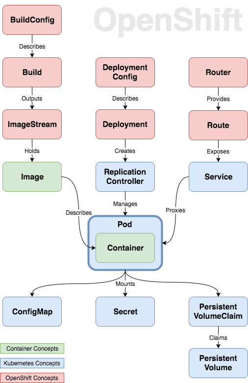
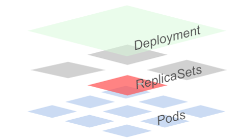

##  Study Documents

---
- [Concept](https://platform.deloitte.com.au/articles/2017/openshift-3-demystified-for-developers/ )
- [Kubernetes deployment](https://kubernetes.io/docs/concepts/workloads/controllers/deployment/ )


##  Kubernetes Commands

---

- [PODS](#pods )
- [Label](#label )
- [Node](#node )
- [Deployments](#deployments )
- [Scaling PODs](#scaling-pods )
- [Revision](#revision )
- [Services](#services )
- [Volumes](#volumes )
- [Storage Class](#storage-class)
- [Secrets](#secrets )
- [ConfigMaps](#configmaps )
- [Ingress](#ingress )
- [Horizontal Pod Autoscalers](#horizontal-pod-autoscaler )
- [Scheduler](#scheduler )
- [Taints and Tolerations](#tains-and-tolerations )
- [Troubleshooting](#troubleshooting )
- [Role Based Access Control (RBAC)](#role-based-access-control )
- [Security Contexts](#security-contexts )
- [Network Policies](#network-policies )
- [Liveness and Readiness](#liveness-and-readiness)

##  note

```
每行可以輸出一個物件
-o wide
取得原檔案
-o json
-o yaml
```
----
##  PODS


``` sh
# 創建一個新 Pod 物件
$ kubectl create -f ./my-pod.yaml

# 顯示 Pod的labels
$ kubectl get pods--show-labels
$ kubectl get pods
$ kubectl get pods --all-namespaces
$ kubectl get pod monkey -o wide
$ kubectl get pod monkey -o yaml
$ kubectl describe pod monkey
```
##  Label


```sh
$ kubectl label pods my-pod env=production
```

##  Node


```sh
#查看目前node的labels
$ kubectl get nodes --show-labels

#新增一個label 到 node test
$ kubectl label node test hardware=high-memory
```


##  Deployments


```sh
$ kubectl run test --image=test --record

└─ Deployment: <name>
   └─ ReplicaSet: <name>-<rs>
       └─ Pod: <name>-<rs>-<randomString>
```
##  Scaling PODs


```sh
$ kubectl scale deployment/POD_NAME --replicas=N
```

##  Revision

```sh
# List history of deployments
$ kubectl rollout history deployment/DEPLOYMENT_NAME
# Revision
$ kubectl rollout undo deployment/DEPLOYMENT_NAME --to-revision=N
```

##  Services

```sh
# create service
$ kubectl create -f ./my-service.yaml

# check service status
$ kubectl get services
$ kubectl get svc

# Expose PODs as services (creates endpoints)
$ kubectl expose deployment/monkey --port=2001 --type=NodePort
```

##  Volumes
- Lits Persistent Volumes and Persistent Volumes Claims

```sh
$ kubectl get pv
$ kubectl get pvc
```
PV & PVC Interaction Lifecycle

##  Storage Class
- Local Storage
```
Provisioning
- static:先建立之後pvc可以選用
- dynamic:預先設定storageclass

Binding
- pvc找到pv ,status unbound-->bound
Using
- 可設定 access mode

Storage Object in Use Protection

Reclaiming
- pvc unboud , pv 可有reclaim policy
  - Retained: 當 PVC 刪除後(PV 狀態為 Released)可以進行手動的 reclaim
  - Deleted: 使用帶有 reclaim policy Delete 的 PVC，當 PVC 刪除後，相對應的 PV & storage 空間會一併刪除
Expanding Persistent Volumes Claims
  - Storage Class 中要預先有 allowVolumeExpansion: true 的定義。
```
```
kind: StorageClass
apiVersion: storage.k8s.io/v1
metadata:
  name: azure-standard
  annotations:
    storageclass.beta.kubernetes.io/is-default-class: 'true'
parameters:
  kind: Managed
  storageaccounttype: Standard_LRS
provisioner: kubernetes.io/azure-disk
reclaimPolicy: Delete
allowVolumeExpansion: true
volumeBindingMode: WaitForFirstConsumer

```

Docs:
- [storage-classes/local](https://kubernetes.io/docs/concepts/storage/storage-classes/#local)

##  Secrets

```sh
$ kubectl get secrets
# kubectl create secret generic 指令創建一個 Secret 物件
$ kubectl create secret generic --help
# 從檔案輸入 sensitive data
$ kubectl create secret generic test --from-file=./username.txt
# 從指令輸入 sensitive data
$ kubectl create secret generic mysql --from-literal=password=root
# 透過 YAML 創建 Secret 物件
$ kubectl create -f ./my-secret.yaml
$ kubectl get secrets mysql -o yaml
```
Docs:
- [Secrets](https://kubernetes.io/docs/concepts/configuration/secret/ )
##  ConfigMaps


```sh
# 設定configMap的value
$ kubectl create configmap mysql-host --from-literal=ip=127.0.0.1
$ kubectl create configmap foobar --from-file=config.js
$ kubectl get configmap foobar -o yaml

# 刪除特定ConfigMap的物件
$ kubectl delete configmap mysql-host
```
Docs :
- [ConfigMaps](https://kubernetes.io/docs/tasks/configure-pod-container/configure-pod-configmap/ )

##  DNS


```sh
# List DNS-POD
$ kubectl get pods --all-namespaces |grep dns
```

- Check DNS for pod nginx (assuming a busybox POD/container is running)

```sh
$ kubectl exec -it busybox -- nslookup nginx
```

> Note: kube-proxy running in the worker nodes manage services and set iptables rules to direct traffic.

##  Ingress


- Manage Ingress for ClusterIP service type

```sh
$ kubectl get ingress
$ kubectl expose deployment grafana --port=3000
```

Docs:

- [Ingress](https://kubernetes.io/docs/concepts/services-networking/ingress/ )

##  Horizontal Pod Autoscaler


```sh
$ kubectl get hpa
$ kubectl autoscale --help
```

##  DaemonSets


```sh
$ kubectl get daemonsets
$ kubectl get ds
```

##  Scheduler


- NodeSelector based policy

```sh
$ kubectl label node minikube foo=bar
```

Node Binding through API Server:

```sh
$ kubectl proxy
$ curl -H "Content-Type: application/json" -X POST --data @binding.json http://localhost:8001/api/v1/namespaces/default/pods/foobar-sched/binding
```

##  Tains and Tolerations


```sh
$ kubectl taint node master foo=bar:NoSchedule
```

##  Troubleshooting


```sh
$ kubectl describe
$ kubectl logs
$ kubectl exec
$ kubectl get nodes --show-labels
$ kubectl get events
```

Docs:
- [Troubleshoot Clusters](https://kubernetes.io/docs/tasks/debug-application-cluster/debug-cluster/ )
- [Debugging-FAQ](https://github.com/kubernetes/kubernetes/wiki/Debugging-FAQ )

##  Role Based Access Control


- Role
  sets permissions within a particular `namespace`
- ClusterRule
  define cluster-scope resource
- Binding
- ClusterRoleBinding

```
$ kubectl create role fluent-reader --verb=get --verb=list --verb=watch --resource=pods
$ kubectl create rolebinding foo --role=fluent-reader --user=minikube
$ kubectl get rolebinding foo -o yaml
```
```yml
apiVersion: rbac.authorization.k8s.io/v1
kind: ClusterRole
metadata:
  # "namespace" omitted since ClusterRoles are not namespaced
  name: secret-reader
rules:
- apiGroups: ["rbac.authorization.k8s.io"]
  resources: ["clusterrolebindings"]
  verbs: ["get", "list", "watch", "create", "update", "patch", "delete","deletecollection"]
- apiGroups: ["policy"]
  resources: ["podsecuritypolicies"]
  verbs: ["get", "list", "watch", "create", "update", "patch", "delete","deletecollection"]
- apiGroups: ["monitoring.coreos.com"]
  resources: ["servicemonitors"]
  verbs: ["get", "list", "watch", "create", "update", "patch", "delete","deletecollection"]
- apiGroups: ["monitoring.coreos.com"]
  resources: ["prometheusrules"]
  verbs: ["get", "list", "watch", "create", "update", "patch", "delete","deletecollection"]
- apiGroups: ["project.openshift.io"]
  resources: ["projects"]
  verbs: ["get", "list", "watch", "create", "update", "patch", "delete","deletecollection"]
```

##  Security Contexts

```
- spec
 - securityContext
   - runAsNonRoot: true
```
Docs:
- [security-context](https://kubernetes.io/docs/tasks/configure-pod-container/security-context/)

##  Network Policies


Network isolation at Pod level by using annotations

```sh
$ kubectl annotate ns <namespace> "net.beta.kubernetes.io/network-policy={\"ingress\": {\"isolation\": \"DefaultDeny\"}}"

#查看正在運行的proxy
$ kubectl get daemonSets --namespace=kube-systm kube-proxy
```

Docs:

- [declare-network-policy](https://kubernetes.io/docs/tasks/administer-cluster/declare-network-policy/ )

## Liveness and Readiness
- liveness probe: 確定何時重新啟動容器
- readiness probe: 當Pod中的容器都處於可用狀態時，才使用readiness probe來確定容器是否已經可以接受流量。

Probe settings:
```
initialDelaySeconds：容器啟動後第一次執行探測是需要等待多少秒。
periodSeconds：執行探測的頻率。至少是10秒，最小1秒。
timeoutSeconds：探測超時時間。最小1秒，最小1秒。
successThreshold：探測失敗後，最少連續探測成功多少次才被認定為成功。default:1。
failureThreshold：探測成功後，最少連續探測失敗多少次才被認定為失敗。default:3。
```
HTTP prob setting:
```
host：連接的主機名，默認連接到pod的IP。您可能想在http header中設置“ Host”而不是使用IP。
scheme：連接使用的架構，HTTP。
path：訪問的HTTP服務器的路徑。
httpHeaders：自定義請求的標頭。HTTP運行重複的標頭。
port：訪問的容器的端口名稱或端口號。端口號必須介於1和65525之間。
```